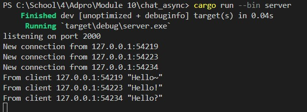
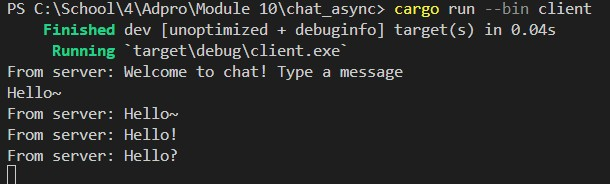
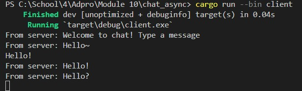
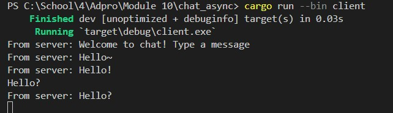
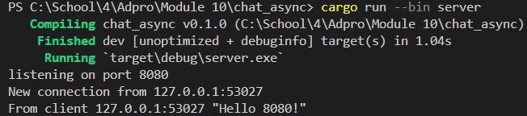
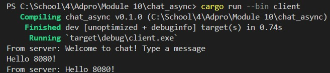
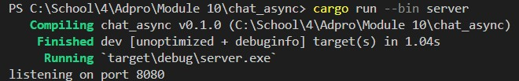
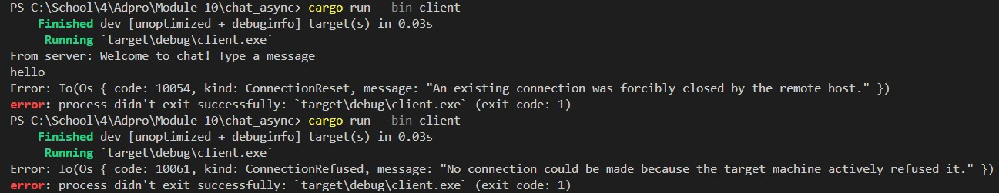

## Reflection

**2.1. Original code**

Server Side  
 

Client Side 1  
 

Client Side 2  
 

Client Side 3  
 

Once the server is up and running, and each client is connected. From the picture above, it is shown that every client and the server receive chat broadcasts from each client. 

Whenever a client types a message in the command line, that string is sent to the server, which then continues to broadcast it to all connected clients.

**2.2. Modifying port**

 
 

When the client and server share the same port (8080). The application will run smoothly like before, as seen in the image.  

 
 

However if we only change one port, let's say the server port becomes 8080 while the client port remains 2000. An error then will occur on the client side because according to the client, the port doesn't have a connection and the program will crash when run, as shown in the image.  

**2.3. Small Changes**